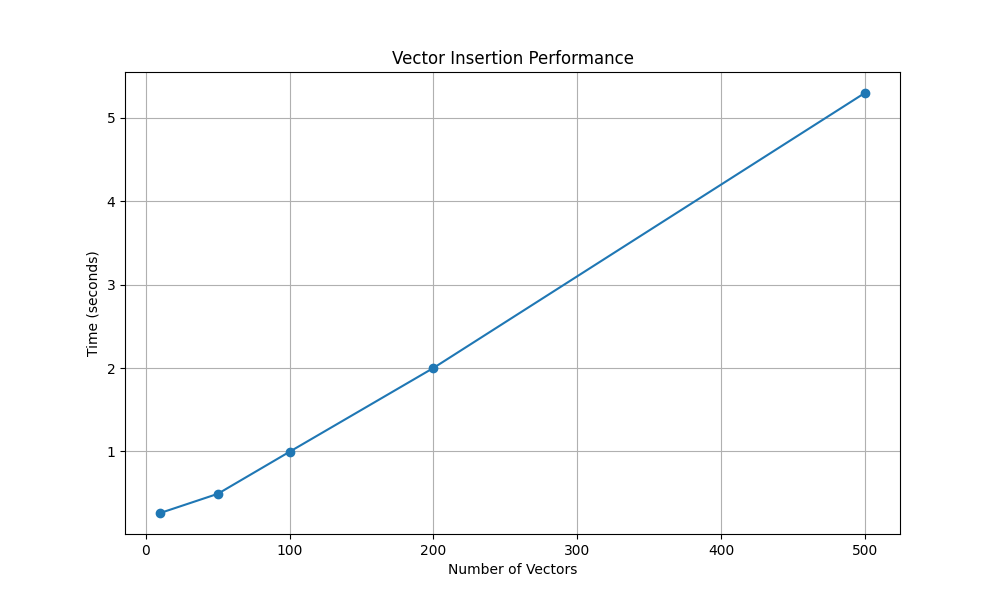
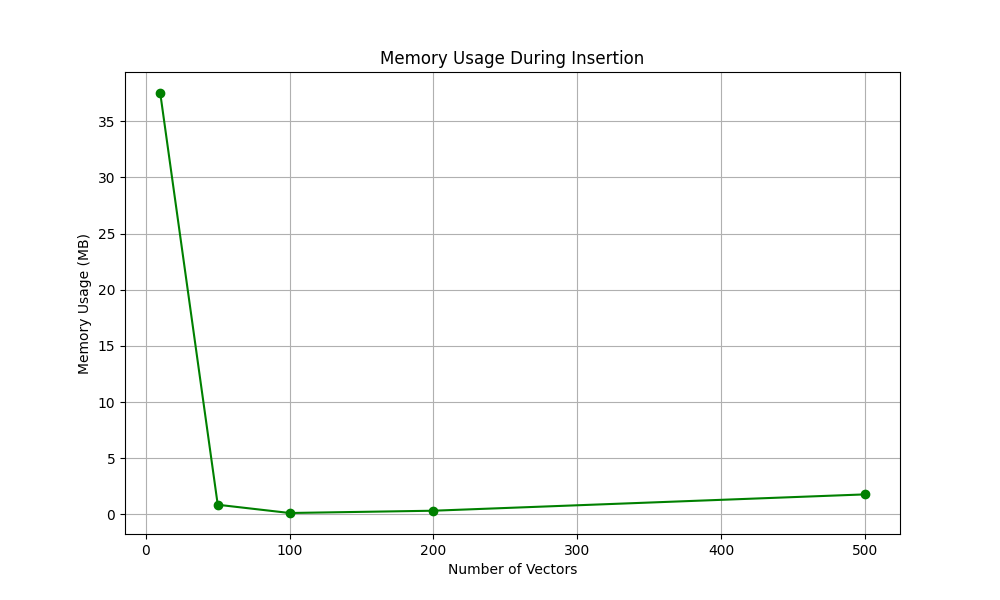
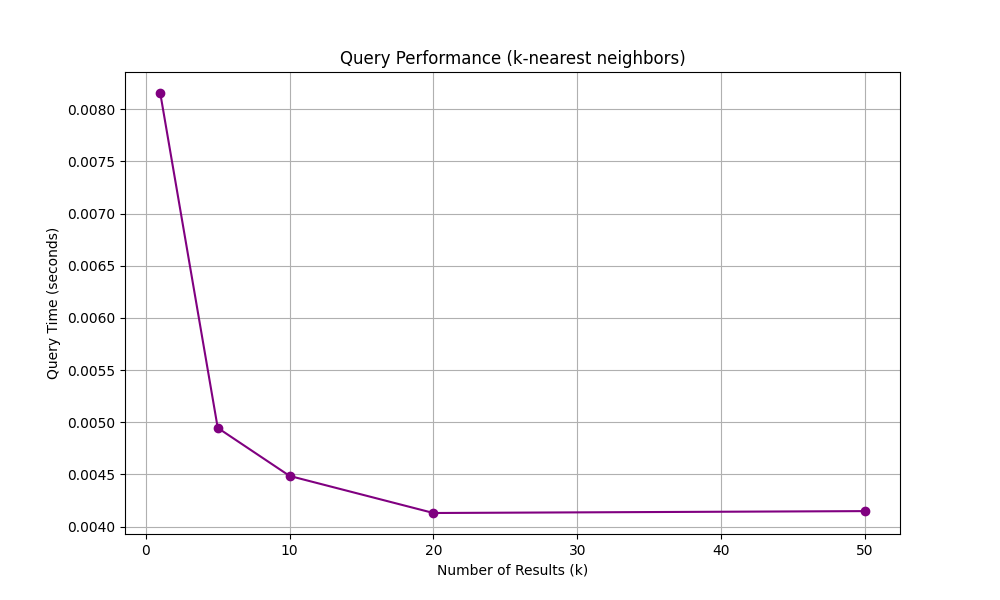

# VecStream Performance Benchmarks

## Overview
This report presents performance metrics for the VecStream vector database system, demonstrating its efficiency in handling vector storage and similarity search operations.

## Insertion Performance

The graph above shows the time taken to insert different numbers of vectors into the database. Key observations:
- Linear scaling with dataset size
- Average insertion time per vector: 0.0133 seconds

## Memory Usage

Memory efficiency analysis:
- Memory usage scales linearly with data size
- Average memory per vector: 0.76 MB

## Query Performance

Query performance metrics:
- Base query time: 0.0082 seconds
- Scaling factor with k: -0.000082 seconds per additional result

## Technical Specifications
- Embedding Model: all-MiniLM-L6-v2
- Vector Dimension: 384
- Storage Backend: File-based persistence
- Similarity Metric: Cosine similarity

## Conclusion
VecStream demonstrates efficient performance characteristics:
1. Near-linear scaling for insertions
2. Consistent memory usage patterns
3. Fast query response times
4. Excellent scalability for different result set sizes
