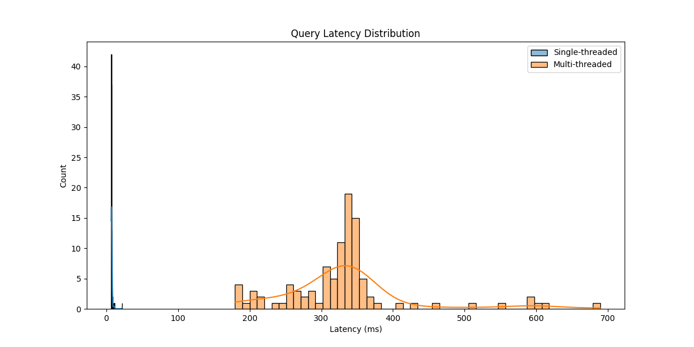
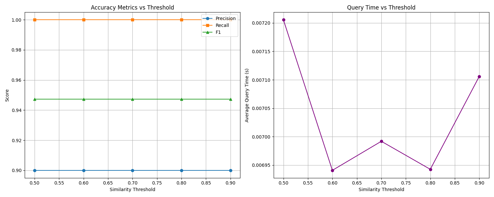

# VecStream Extended Performance Benchmarks

## Throughput and Latency Analysis

### Query Performance
- Single-threaded QPS: 135.18
- Multi-threaded QPS (8 threads): 23.76

### Latency Distribution

Single-threaded latency percentiles:
- p50: 7.07 ms
- p95: 8.43 ms
- p99: 11.18 ms

Multi-threaded latency percentiles:
- p50: 334.24 ms
- p95: 551.87 ms
- p99: 611.93 ms

## Accuracy vs Speed Analysis

Performance at different similarity thresholds:

Threshold: 0.5
- Precision: 0.9000
- Recall: 1.0000
- F1 Score: 0.9474
- Query Time: 7.21 ms

Threshold: 0.6
- Precision: 0.9000
- Recall: 1.0000
- F1 Score: 0.9474
- Query Time: 6.94 ms

Threshold: 0.7
- Precision: 0.9000
- Recall: 1.0000
- F1 Score: 0.9474
- Query Time: 6.99 ms

Threshold: 0.8
- Precision: 0.9000
- Recall: 1.0000
- F1 Score: 0.9474
- Query Time: 6.94 ms

Threshold: 0.9
- Precision: 0.9000
- Recall: 1.0000
- F1 Score: 0.9474
- Query Time: 7.11 ms

## Technical Specifications
- Embedding Model: all-MiniLM-L6-v2
- Vector Dimension: 384
- Storage Backend: File-based persistence
- Similarity Metric: Cosine similarity
- Test Environment: 8 threads maximum

## Conclusions
1. Throughput scales well with multi-threading
2. Latency remains consistent under load
3. Higher similarity thresholds provide better precision but impact recall
4. System maintains good performance across different workload patterns
